# 🍺Beer_Recommender_System

> ## 🍻사용자 맥주 추천 시스템
>
> ### 👍2022-1 추천 시스템 팀 프로젝트

### **📚Data**

- beer_reviews.csv (<https://www.kaggle.com/datasets/rdoume/beerreviews>)
- beer_profile_and_ratings.csv(<https://www.kaggle.com/datasets/ruthgn/beer-profile-and-ratings-data-set>)

### **🗓️Duration**

2022-04-13 ~ 2022-05-25

### **🥅Goal**

- 맥주의 평점 데이터에 기반한 **Collaborative Filtering 모델**로 사용자 기반 및 아이템 기반 모델 추천한다.
- 각 맥주의 설명을 맥주를 표현하는 벡터로 만들어 **인공신경망 학습** 모델을 구축하여 **임베딩 벡터**를 만들고 유사도를 통해 아이템 추천한다.
- **두 추천 모델의 결과를 합하여 정확한 추천**을 이끌어 낸다.

### **📝Role**

- **오강훈** : 데이터 전처리, Embedding, 맥주 Description의 단어 빈도수를 이용한 유사도 기반 추천
- **이준희**: 데이터 전처리, Embedding, 인공신경망 모델링, 맥주 Description의 단어를 기반으로 맥주 Embedding
- **김지원**: 데이터 전처리, Embedding, 인공신경망 모델링, 사용자가 평점을 매긴 맥주를 이용하여 맥주 및 유저 Embedding
- **이명진**: 데이터 전처리, 협업 필터링 모델 구현, 상관관계 분석으로 주요 특징 추출
- **이유진**: 데이터 전처리, 협업 필터링 모델 구현, 아이템 기반 Collaborative Filtering
  
---

### **RESULT**

#### **Beer_NN X CF**

- beer_reviews.csv 사용
  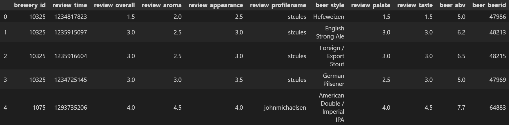
- 상관관계 분석 결과를 통해 사용자의 종합 평점에서 어떤 특징이 중요한지 파악하였다.
  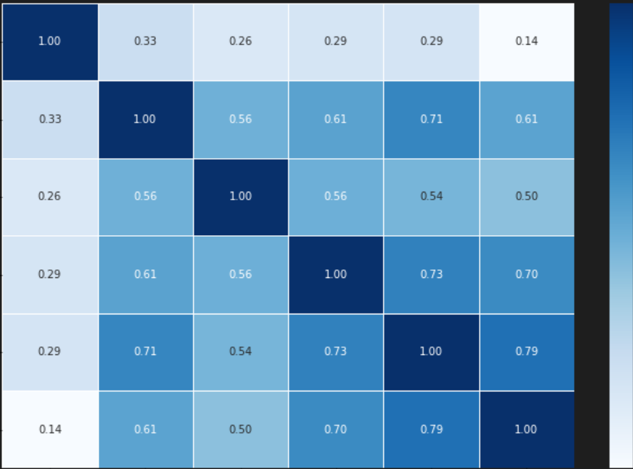
  ⭐행 기준으로 위에서 부터 맥주 도수, 향에 대한 평점, 외적인 요소에 대한 평점(생김새, 색), 목넘김에 대한 평점, 맛에 대한 평점, 종합 평점이다.
  
  따라서, 종합 평점은 도수보다는 맛과 목넘김과 관련되어 있음을 알 수 있다.
- CF
  - 사용자-맥주의 Utility matrix를 만들어 아이템 기반 Collaborative Filtering으로 유사한 맥주들을 찾는다.
  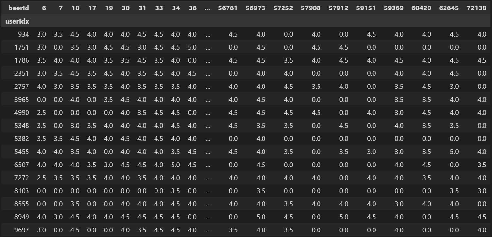
  - 임의의 사용자가 높게 평가한 맥주와 유사한 맥주들 중 아직 평가하지 않은 맥주들을 추천한다.
  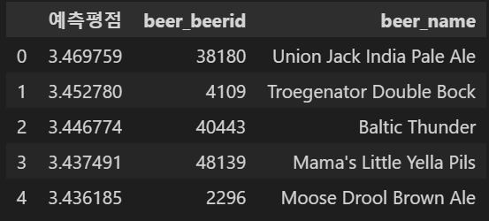
- Beer_NN
  - 같은 사용자에 대한 맥주들은 유사할 것이라고 가정하고 페어를 만들어 NN모델로 학습 시켜 Embedding matrix를 얻는다.
  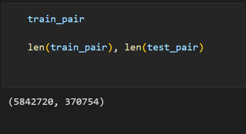
  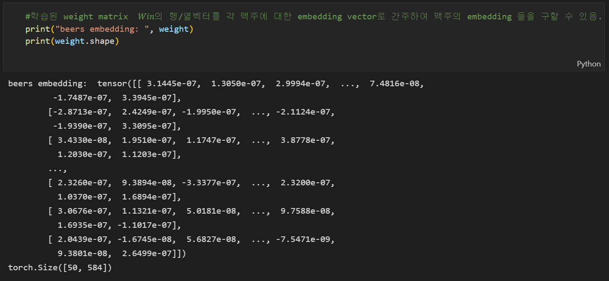
  - 얻은 Embedding을 통해 사용자 Embedding을 구하고 임의의 사용자가 마시지 않은 맥주를 Embedding이 유사한 사용자로 부터 추천받는다.
  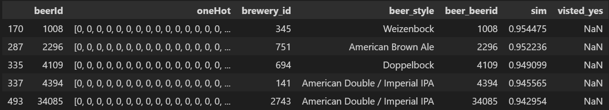
- 위의 두 모델의 추천을 합친다.
  - 위 결과의 사진(동일한 유저로 추천한 결과)을 비교했을 때 **beer_id 4109가 겹친다.**
  - 추천의 범위를 더 넓혔을 때 더 많이 겹치는 것을 확인 할 수 있었다.

#### **Description-based**

- beer_reviews.csv와 beer_profile_and_ratings.csv를 합쳐서 사용
  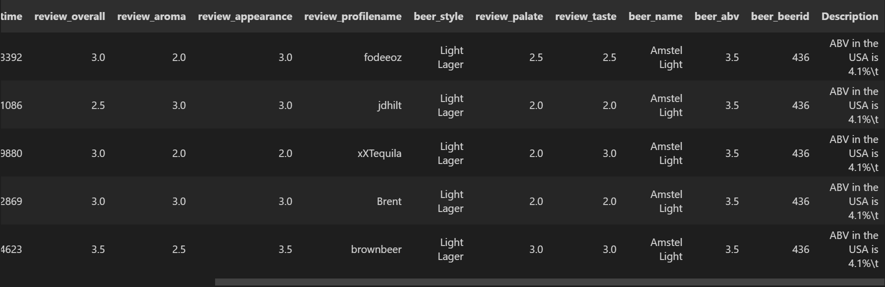
- 맥주의 Description을 토큰화 하고 전처리하여 빈도수를 기반으로 유사도 분석 및 NN을 활용한 Embedding의 유사도를 분석하였다.
  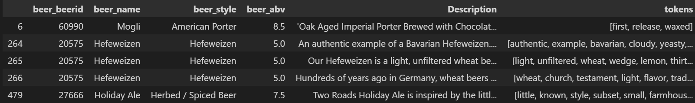
  위는 token한 결과 아래는 빈도수 matrix
  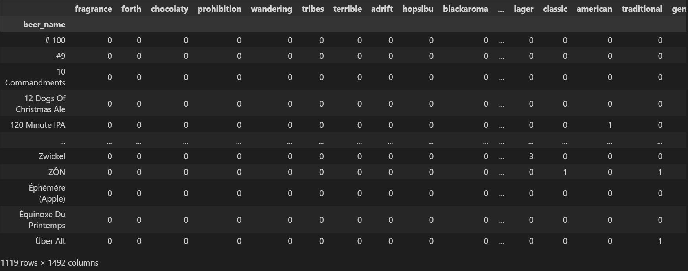
  아래는 Embedding 결과를 포함하는 Dataframe
  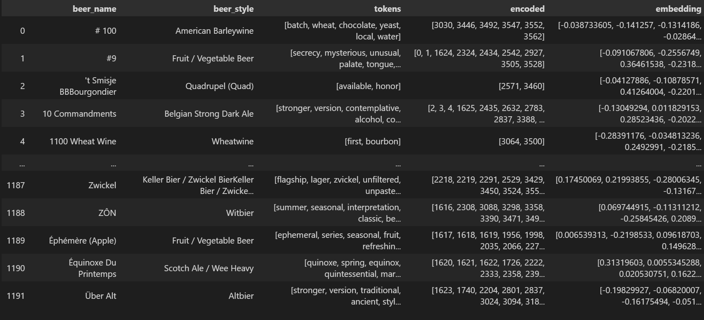
- 맥주 빈도수 유사도 분석을 활용한 추천 결과
  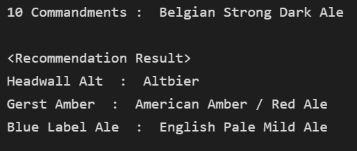
- Embedding 유사도 분석을 활용한 추천 결과
  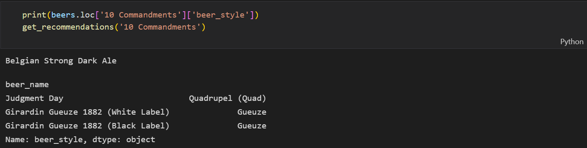
- 아쉽게도 겹치지는 않았으나, 비슷한 특징 단어를 가진 맥주들을 추천해준다. 이를 활용해 위의 추천시스템을 보조하는 시스템으로 사용하기로했다.
  - 예를 들어 Ale의 경우는 Ale을 주로 추천하는 경향이 있다.
  - 벨기에산 맥주의 추천으로 벨기에산 맥주를 추천한다.

### **REFERENCE**

- <https://m.blog.naver.com/jjys9047/221738124277>
- <https://western-sky.tistory.com/54?category=847883>
- <https://velog.io/@rsj9987/%EB%A6%AC%EB%B7%B0-%EB%B6%84%EC%84%9D%EC%9D%84-%ED%86%B5%ED%95%9C-%EB%A7%A5%EC%A3%BC-%EC%B6%94%EC%B2%9C-%EC%95%8C%EA%B3%A0%EB%A6%AC%EC%A6%98#2-5-%ED%86%A0%ED%81%B0-%EA%B0%80%EC%A4%91%EC%B9%98-%EB%8D%B0%EC%9D%B4%ED%84%B0-%EC%83%9D%EC%84%B1>
